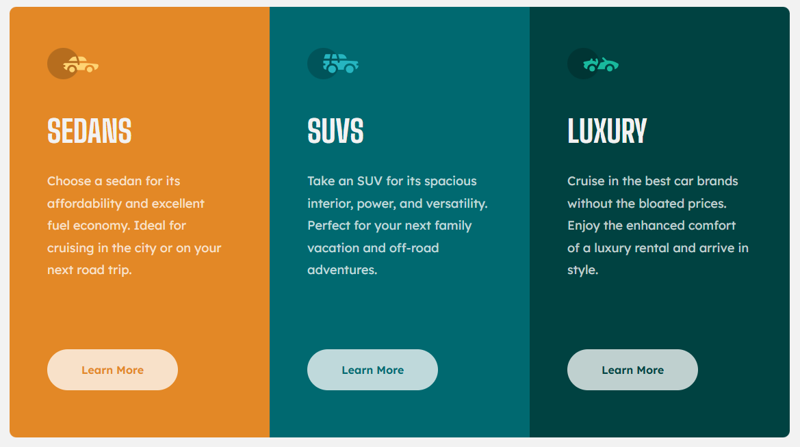
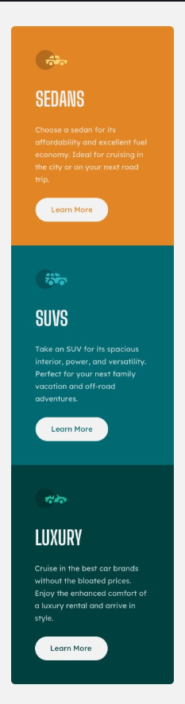
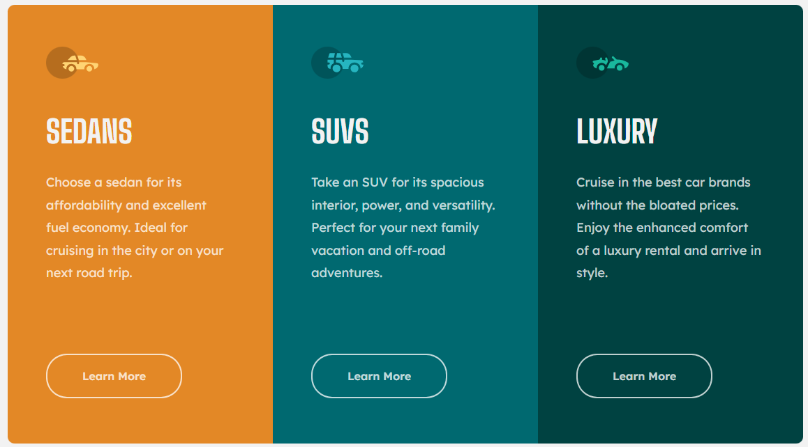

# 🚗 Projeto Landing Page – 3 Colunas

Este é um projeto de landing page simples e elegante, com foco em **design responsivo** e **organização visual em 3 colunas**.  
O objetivo foi treinar conceitos de **HTML semântico**, **CSS moderno (Flexbox e responsividade)** e boas práticas de estruturação de layout.

## 📸 Preview do Projeto

## ✨ Funcionalidades

- Layout totalmente **responsivo**, adaptado para desktops, tablets e celulares.  
- Uso de **Flexbox** para organizar e alinhar os elementos.  
- Estrutura em **HTML semântico**, garantindo acessibilidade e melhor leitura do código.  
- Design clean com foco em **experiência do usuário**.  

## 🧩 Desafios Enfrentados

O maior desafio foi trabalhar o **responsivo**, ajustando o layout para diferentes tamanhos de tela sem perder a harmonia visual.  
Aprendi a refatorar melhor os estilos, organizar espaçamentos e garantir que os cards ficassem consistentes em todas as resoluções.  

## 📱 Preview Mobile

## 📘 O que aprendi

Durante o desenvolvimento, aprimorei bastante a forma de estruturar código e aplicar boas práticas.  
Principais pontos de aprendizado:  

- Uso do pseudo-seletor **`:active`** para estilizar o botão ao ser clicado.  
- Melhoria na lógica de **responsividade** com media queries.  
- Melhor estruturação do **HTML semântico**.  
- Organização e clareza no **CSS**.  

## 🖱️ Preview do Botão Ativo

## 🚀 Tecnologias Utilizadas

- **HTML5**  
- **CSS3** (Flexbox, Media Queries)  

## 🙌 Créditos

Este projeto foi desenvolvido com base em um desafio do [Frontend Mentor](https://www.frontendmentor.io).

## 👨‍💻 Autor

Desenvolvido por **Eduardo de Paula** como parte do aprendizado em desenvolvimento front-end.  
Sinta-se à vontade para contribuir ou se inspirar para seus próprios estudos