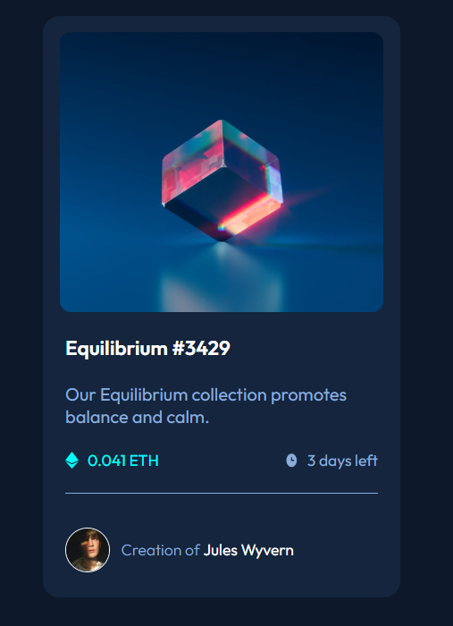

# 💎 NFT Card Preview

Projeto desenvolvido como parte de um desafio de HTML e CSS, inspirado no layout fornecido pelo **Frontend Mentor**.  
O objetivo foi criar um **cartão interativo** que apresenta informações sobre um NFT, aplicando conceitos de **HTML semântico** e **CSS moderno**.

## 📸 Prévia do Projeto

  

## 🚀 Tecnologias Utilizadas
- **HTML5** – Estrutura semântica e acessível  
- **CSS3** – Flexbox, variáveis CSS e estilização customizada  
- **Google Fonts** – Fonte *Outfit*

## 🎯 Objetivos do Projeto
- Praticar a criação de layouts responsivos
- Utilizar **HTML semântico** para melhorar acessibilidade
- Estilizar elementos de forma customizada (ex.: botões, hr, imagens com borda)
- Reproduzir fielmente o design proposto

## 🙌 Créditos

Este projeto foi desenvolvido com base em um desafio do [Frontend Mentor](https://www.frontendmentor.io).  
A proposta ajuda no aperfeiçoamento de habilidades em HTML, CSS e boas práticas de layout responsivo.

## 👨‍💻 Autor

Desenvolvido por **Eduardo** como parte do aprendizado em desenvolvimento front-end.  
Sinta-se à vontade para contribuir ou se inspirar para seus próprios estudos