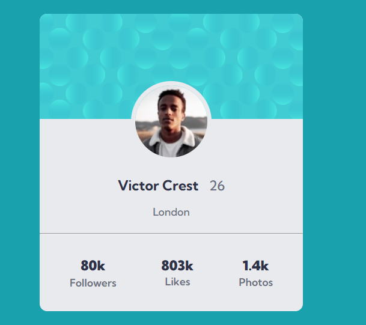

# 📌 Projeto Landing Page - Card de Perfil  

Este projeto é uma **Landing Page minimalista** que apresenta um **card de perfil interativo e responsivo**.  
O objetivo foi praticar conceitos de **HTML semântico** e **CSS moderno**, utilizando **Flexbox** para organização e estilização do layout.  

## 📸 Preview do Projeto  
  

## ✨ Funcionalidades  

- Layout construído com **Flexbox**, garantindo praticidade no alinhamento dos elementos  
- Estrutura em **HTML semântico** para melhor legibilidade e acessibilidade  
- Design moderno e limpo, com destaque para o **avatar** e estatísticas do usuário  

## ⚡ Desafios enfrentados  

Durante o desenvolvimento, **não enfrentei grandes dificuldades**, mas tive pequenos ajustes para alinhar corretamente o avatar e organizar os elementos do card.  
Esses detalhes me ajudaram a **prestar mais atenção na responsividade e no espaçamento**, garantindo que o layout ficasse mais harmônico e fiel ao design.  

## 📚 O que aprendi  

- Melhorar a **estruturação do HTML**, deixando o código mais organizado e semântico  
- Evoluir minhas habilidades em **CSS**, principalmente no uso de **Flexbox** e boas práticas de estilização  
- A importância dos **detalhes de espaçamento, alinhamento e responsividade**, que fazem diferença no resultado final  

👉 Esse projeto foi uma ótima oportunidade para reforçar conceitos básicos de **frontend** e trabalhar em um componente prático que pode ser aplicado em diversos contextos.

## 🚀 Tecnologias Utilizadas

- **HTML5**  
- **CSS3** ( Flexbox )  

## 🙌 Créditos

Este projeto foi desenvolvido com base em um desafio do [Frontend Mentor](https://www.frontendmentor.io).

## 👨‍💻 Autor

Desenvolvido por **Eduardo de Paula** como parte do aprendizado em desenvolvimento front-end.  
Sinta-se à vontade para contribuir ou se inspirar para seus próprios estudos