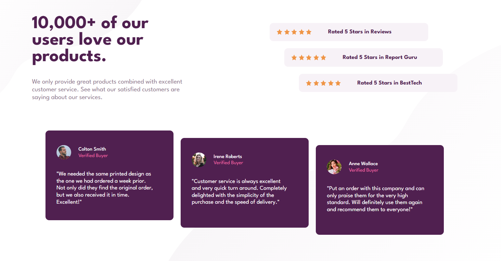
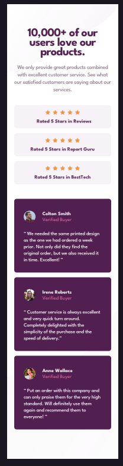

# 📌 Projeto: Seção de Prova Social  

Este projeto é uma seção de **prova social** inspirada em páginas de **landing page**, onde o objetivo é destacar a satisfação de clientes através de avaliações e depoimentos. A ideia é simular uma área que reforça a credibilidade do produto/serviço e gera mais confiança para novos usuários.  

## 📖 Descrição do Projeto  

A seção contém um título principal destacando o número de clientes satisfeitos, acompanhado de depoimentos e avaliações com estrelas. O design foi implementado pensando em responsividade, de modo que a interface se adapta bem em diferentes tamanhos de tela.  

O layout foi construído com **HTML semântico** e estilizado com **CSS3**, utilizando **Flexbox** para organizar e alinhar os elementos de forma eficiente.  

---

## 🖥️ Preview do Projeto Desktop  
  

## ⚙️ Funcionalidades  

- ✅ Totalmente responsivo  
- ✅ HTML semântico  
- ✅ Uso de Flexbox para estrutura e alinhamento  
- ✅ Layout fiel ao design original  
- ✅ Boa legibilidade do conteúdo em diferentes telas  

## 🚧 Desafios Enfrentados  

O maior desafio que enfrentei nesse projeto foi trabalhar corretamente com o **background-image**, ajustando para diferentes resoluções e mantendo a harmonia do layout.  

Também foquei bastante no **responsivo**, garantindo que cada seção se adaptasse bem a telas menores, como smartphones.  

## 📱 Preview Mobile  
  

---

## 📚 O que Aprendi  

- Melhor prática no uso de **HTML semântico**  
- Aperfeiçoamento no uso de **background-image**  
- Melhor adaptação no **responsivo** para telas pequenas  
- Desenvolvimento de **pensamento lógico e rápido** na resolução de problemas  

## 🛠️ Tecnologias Utilizadas  

- **HTML5** → Estrutura do conteúdo com semântica  
- **CSS3** → Estilização do layout e responsividade  
- **Flexbox** → Organização e alinhamento dos elementos  

## 🙌 Créditos

Este projeto foi desenvolvido com base em um desafio do [Frontend Mentor](https://www.frontendmentor.io).

## 👨‍💻 Autor

Desenvolvido por **Eduardo de Paula** como parte do aprendizado em desenvolvimento front-end.  
Sinta-se à vontade para contribuir ou se inspirar para seus próprios estudos