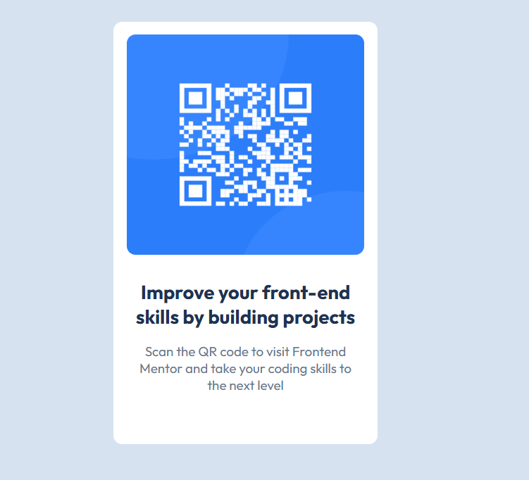

# 📱 QR Code Component

O projeto consiste em um cartão contendo um QR Code, que ao ser escaneado leva o usuário ao site do Frontend Mentor. com o objetivo de treinar HTML e CSS recriando um cartão com QR Code.

---

---

## 🚀 Tecnologias

- **HTML5**
- **CSS3**
- **Flexbox**

## 🙌 Créditos

Este projeto foi desenvolvido com base em um desafio do [Frontend Mentor](https://www.frontendmentor.io).  
A proposta ajuda no aperfeiçoamento de habilidades em HTML e CSS.

## 👨‍💻 Autor

Desenvolvido por **Eduardo** como parte do aprendizado em desenvolvimento front-end.  
Sinta-se à vontade para contribuir ou se inspirar para seus próprios estudos