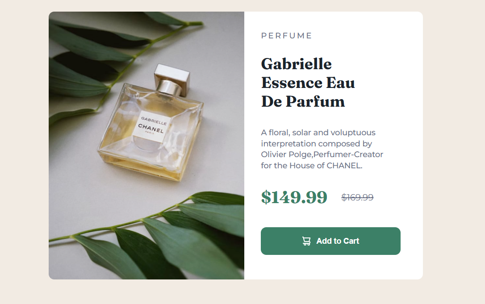

# 📘 Card Produto

Projeto desenvolvido como parte de um desafio front-end para treinar HTML, CSS e técnicas de responsividade.  
O objetivo é criar um componente visual que exiba um produto, utilizando boas práticas de layout e estilo.

## 📸 Preview

## 🚀 Funcionalidades

- Layout responsivo para diferentes tamanhos de tela (desktop e mobile)
- Componente de resultado com visual moderno e acessível
- Uso eficiente de Flexbox para estruturação do layout
- Organização semântica do HTML

## 💻 Tecnologias Utilizadas

- **HTML5** – Estrutura semântica e acessível
- **CSS3** – Estilização com foco em responsividade
- **Flexbox** – Para alinhamento e distribuição dos elementos na interface

## 🎯 Desafios Enfrentados

- **Responsividade**: adaptar a estrutura para funcionar bem em telas menores
- **Design fiel ao modelo**: replicar com precisão o design do desafio usando apenas HTML e CSS, sem frameworks, foi um excelente exercício de atenção aos detalhes.

## 🧠 O que eu aprendi

- 
- Técnicas de espaçamento usando `gap`,  e `line-height`
- Semântica HTML com tags como `main`, `section` e `article`

## 🙌 Créditos

Este projeto foi desenvolvido com base em um desafio do [Frontend Mentor](https://www.frontendmentor.io).  
A proposta ajuda no aperfeiçoamento de habilidades em HTML, CSS e boas práticas de layout responsivo.

## 👨‍💻 Autor

Desenvolvido por **Eduardo** como parte do aprendizado em desenvolvimento front-end.  
Sinta-se à vontade para contribuir ou se inspirar para seus próprios estudos