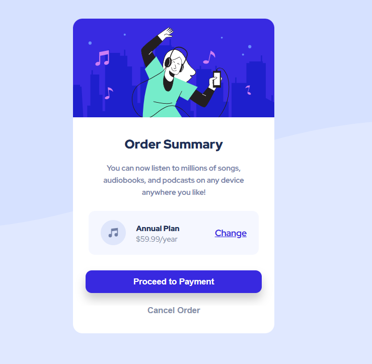

# 🎵 Order Summary Card

Este é um projeto de **componente de cartão de resumo de pedido** desenvolvido como desafio de prática de HTML e CSS.  
Ele simula um cartão de pagamento com informações sobre um plano anual de assinatura, botões de ação e um layout responsivo.

## 📸 Preview

## 🚀 Tecnologias utilizadas

- **HTML5** → Estrutura semântica
- **CSS3** → Estilização e layout
- **Flexbox** → Organização dos elementos
- **Variáveis CSS** → Gerenciamento de cores e espaçamentos
- **Google Fonts** → Tipografia personalizada

## 💡 Aprendizados

Durante o desenvolvimento deste projeto, foi possível praticar:

- ✅ Estruturação semântica em **HTML**
- ✅ Uso de **Flexbox** para alinhamento
- ✅ Criação de **botões estilizados** com efeitos de `hover` e `active`
- ✅ Utilização de **variáveis CSS** para manter consistência nas cores

## 🙌 Créditos

Este projeto foi desenvolvido com base em um desafio do [Frontend Mentor](https://www.frontendmentor.io).  
A proposta ajuda no aperfeiçoamento de habilidades em HTML, CSS e boas práticas de layout.

## 👨‍💻 Autor

Desenvolvido por **Eduardo** como parte do aprendizado em desenvolvimento front-end.
  
Sinta-se à vontade para contribuir ou se inspirar para seus próprios estudos