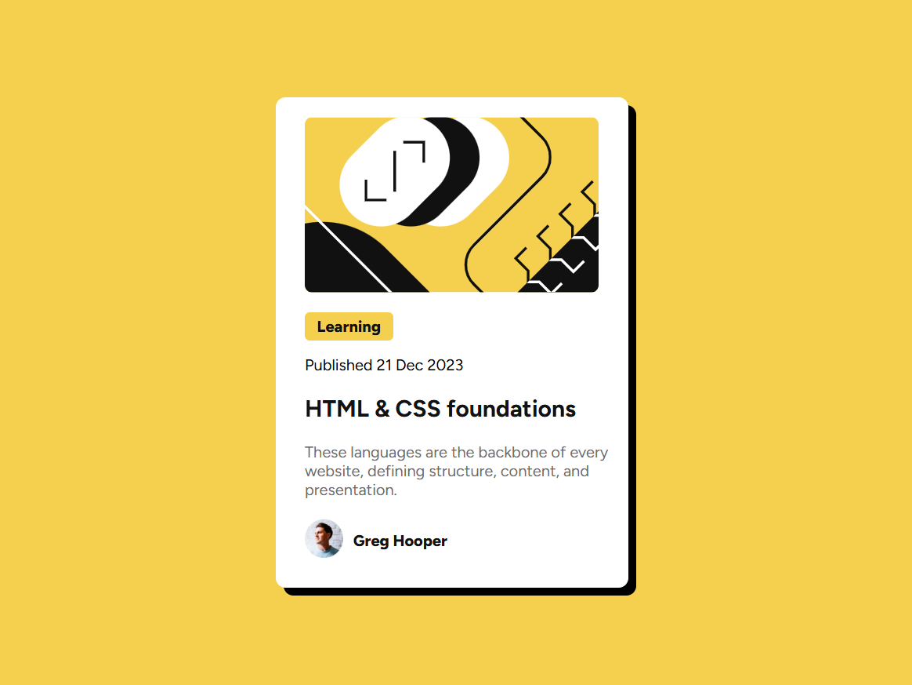

# 🧱 Cartão de Blog - HTML & CSS Foundations

Este projeto é uma prática de HTML e CSS que simula um **cartão de artigo**, com foco em estrutura semântica, estilo moderno e responsivo, utilizando **Flexbox** e **variáveis CSS**.

## 📸 Preview

## 🛠️ Tecnologias Utilizadas

- HTML5 semântico
- CSS3 com Flexbox
- Fonte: [Figtree - Google Fonts](https://fonts.google.com/specimen/Figtree)
- Paleta: tons de amarelo e preto

## 🧠 Funcionalidades

- Centralização total do conteúdo com Flexbox  
- 
- Semântica com uso de `<main>`, `<section>`, `<figure>`, etc.  
- Acessibilidade básica e boa estrutura de leitura 

## 🙌 Créditos

Este projeto foi desenvolvido com base em um desafio do [Frontend Mentor](https://www.frontendmentor.io).  
A proposta ajuda no aperfeiçoamento de habilidades em HTML, CSS e boas práticas de layout responsivo.

## 👨‍💻 Autor

Desenvolvido por **Eduardo** como parte do aprendizado em desenvolvimento front-end.  
Sinta-se à vontade para contribuir ou se inspirar para seus próprios estudos