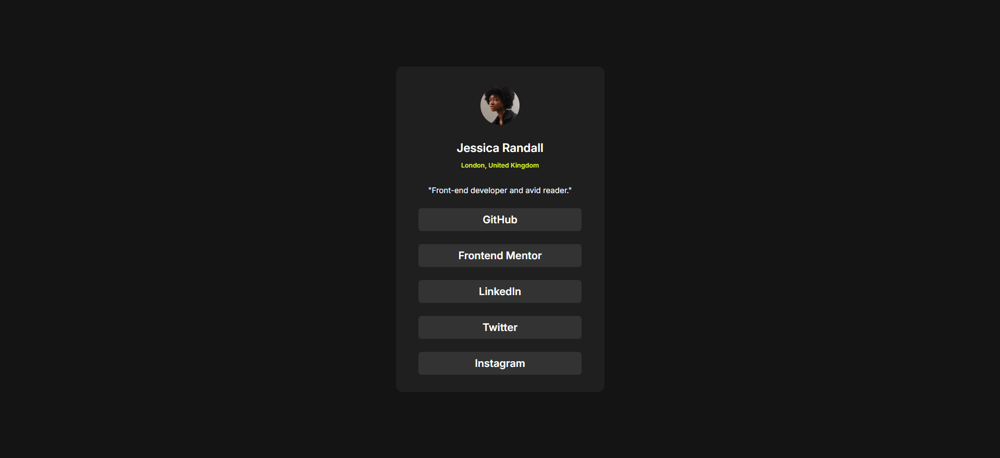

# 🌐 Social Profile Card

Projeto de um **cartão de perfil social** desenvolvido com HTML e CSS, inspirado em componentes modernos de interface.

## 🖼️ Visão Geral

Cartão com imagem de perfil, nome, localização, descrição e links para redes sociais. Possui destaque visual em `hover`, layout responsivo e uso de variáveis CSS.

## 📸 Layout

 

## ✨ Tecnologias Utilizadas

- ✅ HTML5 semântico
- ✅ CSS3 com Flexbox
- ✅ Variáveis CSS (`:root`)
- ✅ Reset CSS para uniformidade entre navegadores

## 🧠 Funcionalidades

- Centralização total do conteúdo com Flexbox  
- Layout simples e limpo  
- Hover nos botões com alteração de cor de fundo e texto  
- Semântica com uso de `<main>`, `<section>`, `<nav>`, `<figure>`, etc.  
- Acessibilidade básica e boa estrutura de leitura 

## 🙌 Créditos

Este projeto foi desenvolvido com base em um desafio do [Frontend Mentor](https://www.frontendmentor.io).  
A proposta ajuda no aperfeiçoamento de habilidades em HTML, CSS e boas práticas de layout responsivo.

## 👨‍💻 Autor

Desenvolvido por **Eduardo** como parte do aprendizado em desenvolvimento front-end.  
Sinta-se à vontade para contribuir ou se inspirar para seus próprios estudos

