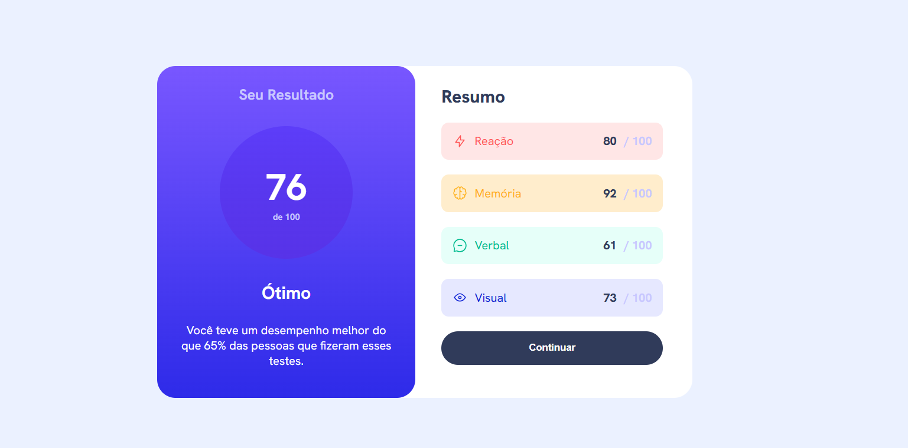

# 🎯 Projeto | Componente de Resultado

Este é um projeto de interface para exibir o resultado de um teste de desempenho. Ele apresenta um design moderno e responsivo, inspirado em desafios de front-end como os da plataforma

## 📸 Preview

## 🧠 Desafios Enfrentados

Durante o desenvolvimento, os principais desafios foram:

- **Responsividade**: adaptar o layout para funcionar bem em diferentes tamanhos de tela exigiu bastante ajuste fino, especialmente em telas menores.
  
- **Flexbox**: usar Flexbox corretamente para alinhar os elementos e distribuir os espaços de forma consistente foi um dos pontos mais delicados. Garantir que o conteúdo ficasse centralizado, responsivo e visualmente agradável foi uma etapa que exigiu testes e refinamentos.

## 🛠️ Tecnologias Utilizadas

- HTML5  
- CSS3  
- Flexbox

## 🙌 Créditos

Este projeto foi desenvolvido com base em um desafio do [Frontend Mentor](https://www.frontendmentor.io).  
A proposta ajuda no aperfeiçoamento de habilidades em HTML, CSS e boas práticas de layout responsivo.

## 👨‍💻 Autor

Desenvolvido por **Eduardo** como parte do aprendizado em desenvolvimento front-end.  
Sinta-se à vontade para contribuir ou se inspirar para seus próprios estudos